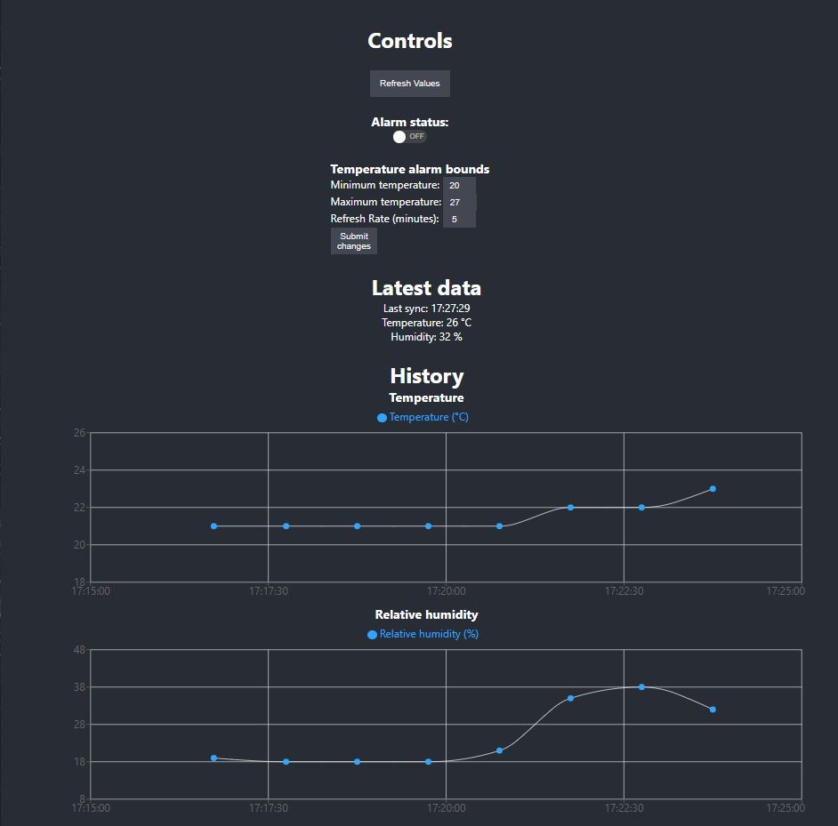
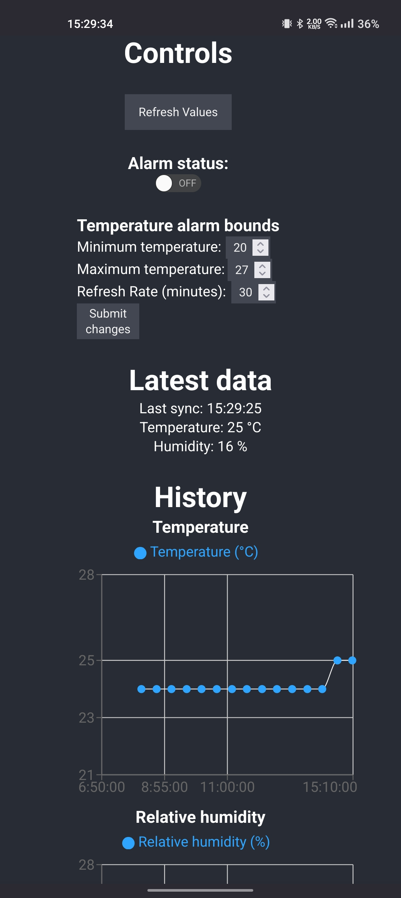

# WemosD1 Temperature measurement system

This is a project based on WemosD1 IoT dev board. It has backend side written in arduino language and frontend parts are developed with React.

## Backend explained 

This is an IoT project that logs temperature and humidity values using a DHT11 sensor, and displays the data in a webpage served by an ESP8266 board. The project also features an alarm system that activates when the temperature falls below a set threshold. Here is a brief explanation of the code:

The code starts by importing the necessary libraries, which include the DHT11 library for reading the temperature and humidity values, the ArduinoJson library for processing JSON data, the WiFiUdp library for establishing an NTP client, and the aWOT library for setting up a web server.

The code defines some constants and variables, including the pin numbers for the DHT11 sensor and the alarm, the Wi-Fi SSID and password, the refresh rate, and the upper and lower alarming bounds. It also sets up a WiFi connection, an NTP client, and a web server using the aWOT library.

The code defines several functions, including a function for adding temperature, humidity, and time values to an array, a function for logging the current temperature and humidity values and updating the array, and several functions for handling HTTP requests from the frontend, including requests for reading and updating the alarm status, updating the alarming bounds, and getting all the current data.

The code then sets up the web server endpoints for the HTTP requests, and defines the main setup and loop functions for running the program. The loop function checks for incoming client connections and processes any incoming HTTP requests. It also logs the current temperature and humidity values every refresh rate minutes and activates the alarm if the temperature falls below the lower alarming bound.

## Frontend explained

This is a React class component that renders a temperature monitoring dashboard. It fetches data from the server and updates the component state accordingly. The component includes a method named renderXYChart that renders a scatter chart. The method takes several parameters to customize the chart's appearance, such as the data, the axis names, and the formatter functions.

The component's state includes several fields, such as alarmOn, currentTemperature, currentHumidity, syncTime, historyData, minimumTemp, maximumTemp, and refreshRate. The handleRefreshClick method fetches the latest data from the server and updates the component state accordingly.

The component also includes a form that allows the user to update the sensor's maximum and minimum temperature values, as well as the refresh rate. The handleSubmit method handles the form submission and sends a PUT request to the server with the updated values. If the minimum temperature value is greater than or equal to the maximum temperature value, an alert is displayed to the user.

The handleStateChange and setalarmState methods are responsible for managing the alarm state. The handleStateChange method sends a PUT request to the server to update the alarm state, while the setalarmState method updates the component state with the current alarm state fetched from the server.

Overall, this component provides a simple and customizable way to display and monitor temperature data, as well as to configure the sensor's settings.

## Note: 

You have to build this project yourself for your wemos and to use your own router logins. 

## Pictures:

Desktop UI:

Mobile UI:

Note: Some of this brief readme.md file has been written with LLM;

